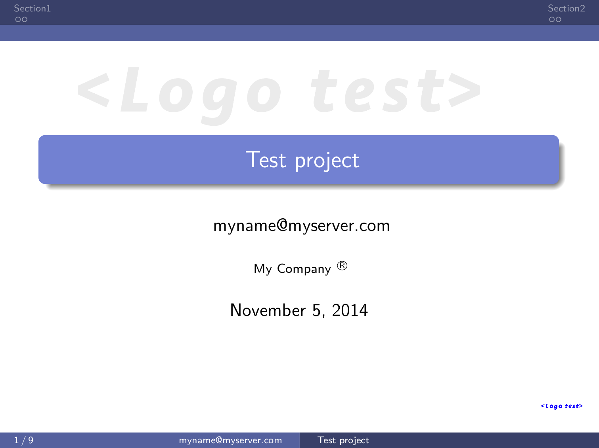
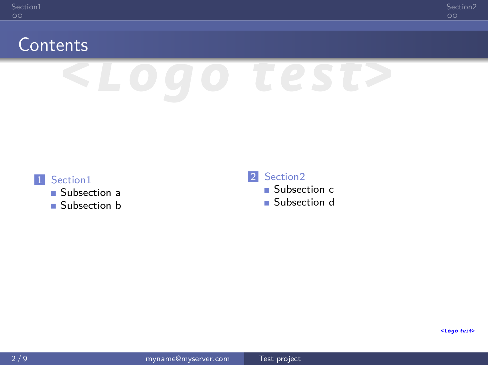
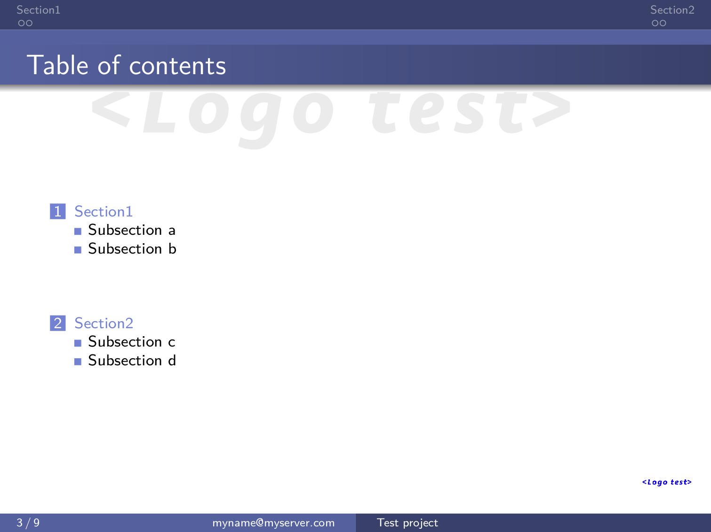
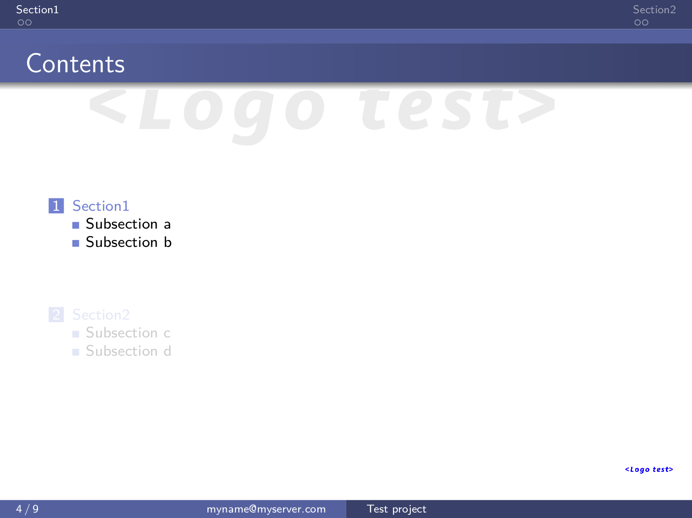
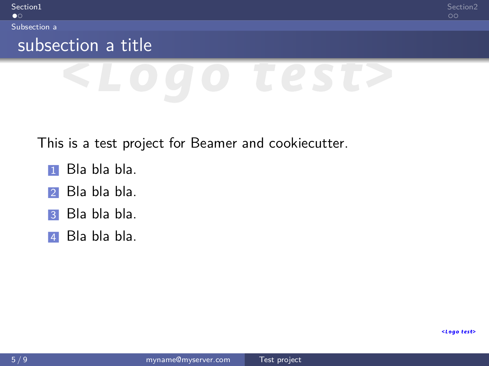
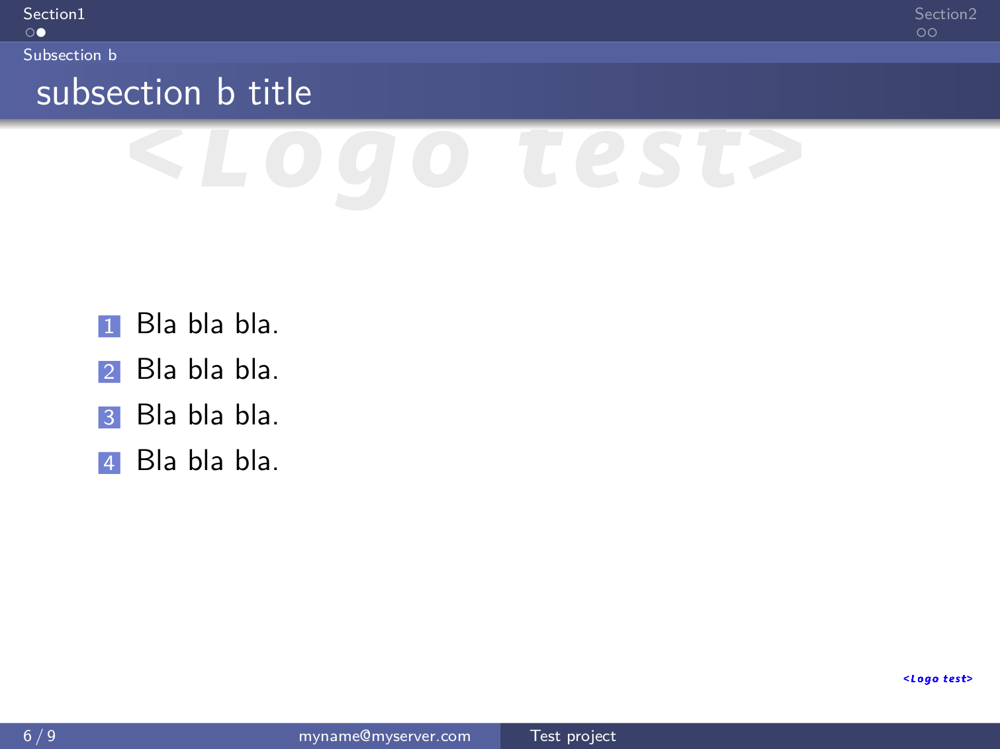
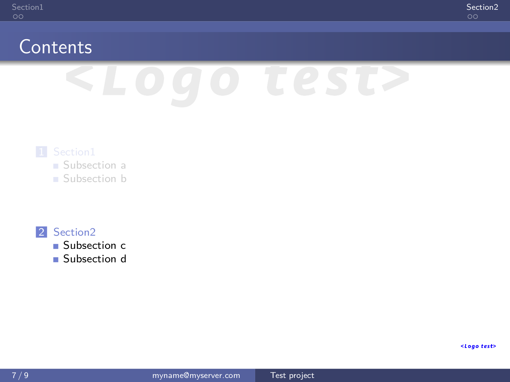

cookiecutter-beamer
===================

Cookiecutter template for a LaTeX Beamer presentation.

    `cookiecutter https://github.com/luismartingil/cookiecutter-beamer.git`

Installation
------------

Install latex dependencies and Pygments for source code highlight.

- Debian:

    # Installing some dependencies

    sudo apt-get install texlive-base texlive-fonts-recommended texlive-latex-base texlive-latex-recommended texify tex-gyre texlive-xetex texlive-pictures texlive-luatex texlive-bibtex-extra texlive-extra-utils texlive-font-utils texlive-fonts-extra texlive-formats-extra texlive-generic-extra texlive-games texlive-plain-extra texlive-latex-extra texlive-science texlive-base texlive-fonts-recommended texlive-latex-base ttf-dejavu-core ttf-dejavu ttf-liberation ttf-bitstream-vera

    # `lstcustom.sty` and `minted.sty` are provided within this repo

    sudo cp *.sty /usr/share/texmf/tex/latex/

    sudo texhash

    # Install python Pygments for minted source code

    sudo pip install Pygments

    # Run the pdflatex command

    make

Output
------

Check this `pdf file <bin/main.pdf>`_

- Some screenshots:

.. image:: bin/main008.png